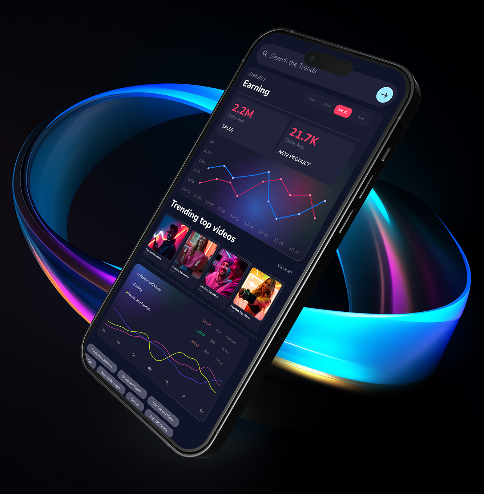

<div align="center">
  <h1>🚀 Fametonic</h1>
  <p>Turn Social Media Into a Profitable Career</p>
</div>

<div align="center">
  
</div>

This is a [Next.js](https://nextjs.org) project bootstrapped with [`create-next-app`](https://nextjs.org/docs/app/api-reference/cli/create-next-app).

## 🌟 Overview

Fametonic is a modern web application built with Next.js that helps aspiring influencers grow their social media presence and turn it into a profitable career. The platform offers AI-powered tools, step-by-step lessons, and expert-led courses.

## 🛠 Tech Stack

- **Framework:** [Next.js 15](https://nextjs.org/)
- **Styling:** [Tailwind CSS](https://tailwindcss.com/)
- **Testing:** [Jest](https://jestjs.io/) & [React Testing Library](https://testing-library.com/react)
- **Package Manager:** [pnpm](https://pnpm.io/)
- **Fonts:** Custom optimized fonts using [`next/font`](https://nextjs.org/docs/app/building-your-application/optimizing/fonts)

## 🚀 Getting Started

### Prerequisites

- Node.js 18.x or later
- pnpm 8.x or later

### Installation

```bash
# Install pnpm if you haven't already
curl -fsSL https://get.pnpm.io/install.sh | sh -

# Install dependencies
pnpm install
```

First, run the development server:

```bash
npm run dev
# or
yarn dev
# or
pnpm dev
# or
bun dev
```

Open [http://localhost:3000](http://localhost:3000) with your browser to see the result.

## Learn More

To learn more about Next.js, take a look at the following resources:

- [Next.js Documentation](https://nextjs.org/docs) - learn about Next.js features and API.
